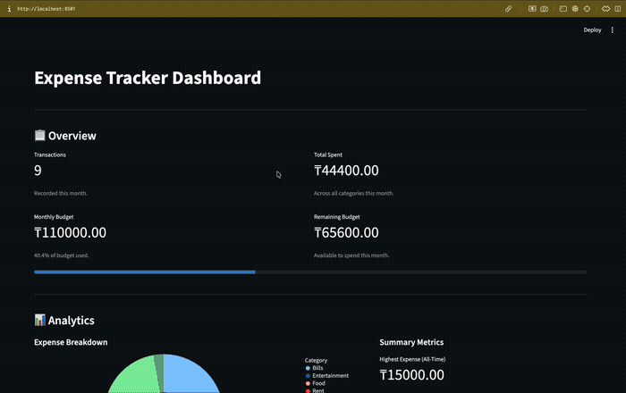
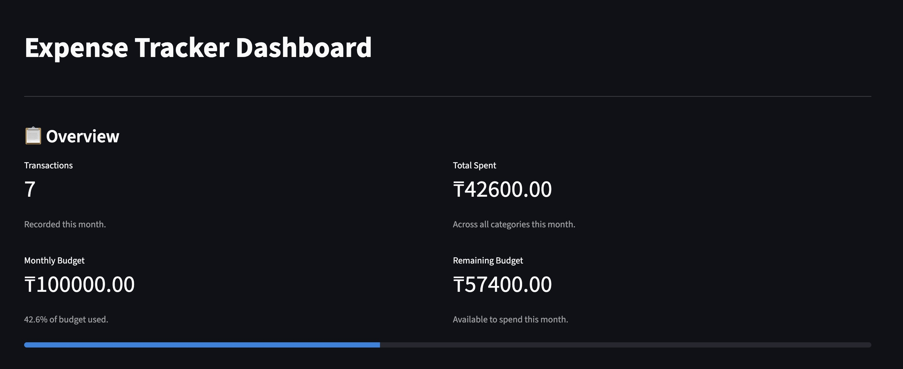
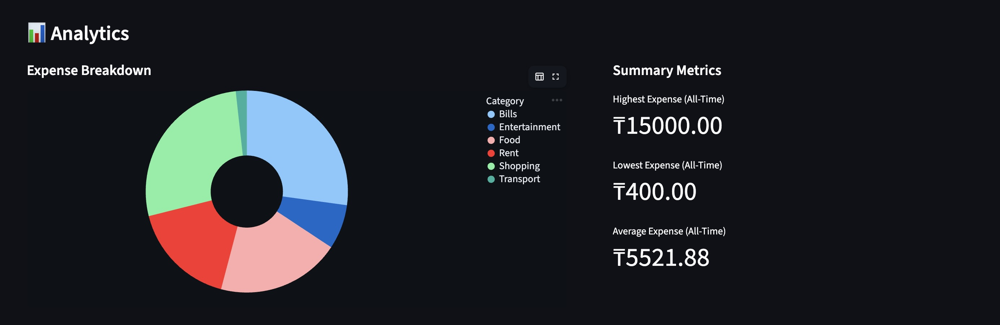
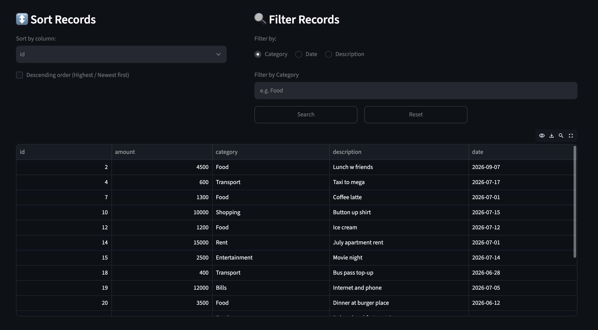
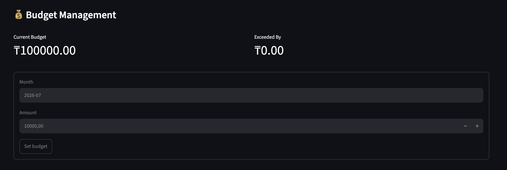

# 💰 AI Finance Tracker

A full-stack personal finance application for tracking expenses — built with a FastAPI REST backend, an interactive Streamlit dashboard, and Google Gemini for AI-generated financial insights.



## ✨ What it does

- **Add, view, sort, filter, and delete expenses** through a clean dashboard
- **Set a monthly budget** and track how much you've spent against it, in real time
- **Visual breakdown** of spending by category (donut chart) and a quick-glance summary
  (highest/lowest/average expense)
- **AI Financial Advisor** — click a button and get a written analysis of your spending
  habits, or type a specific question and get a direct answer, both powered by Gemini
- **49 automated tests** covering the core logic, so the numbers can actually be trusted

## 📸 Screenshots

| Overview | Analytics |
|---|---|
|  |  |

| Sorting & Filtering |
|---|
|  |

| AI Financial Advisor | Budget Management |
|---|---|
|  |  |

## 🛠️ Built with

| Layer | Tech |
|---|---|
| Backend / API | FastAPI, Pydantic |
| Database | SQLite |
| Frontend | Streamlit |
| Charts | Altair |
| AI | Google Gemini API |
| Testing | pytest |

## 🏗️ How it's structured

```
┌─────────────┐      HTTP/JSON       ┌─────────────┐        SQL         ┌──────────────┐
│  Streamlit  │  ────────────────▶   │   FastAPI   │  ────────────────▶ │    SQLite    │
│  Dashboard  │  ◀────────────────   │   Backend   │  ◀──────────────── │    (.db)     │
└─────────────┘                      └──────┬──────┘                    └──────────────┘
                                            │
                                            │  prompt + context
                                            ▼
                                    ┌───────────────┐
                                    │  Gemini API   │
                                    └───────────────┘
```

Streamlit never talks to the database directly — every read and write goes through FastAPI, which is where all the validation and business logic actually lives.
The Gemini calls are isolated in their own module and only ever triggered from the backend, so the API key never has to touch the frontend.

## 🚀 Running it locally

### Prerequisites
- Python 3.10+
- A [Gemini API key](https://ai.google.dev/) (free tier available)

### Installation

```bash
git clone https://github.com/hayaaais/ai-finance-tracker.git
cd ai-finance-tracker
pip install -r requirements.txt
```

Copy the example env file and add your Gemini API key:

```bash
cp .env.example .env
```

```
GEMINI_API_KEY="your_actual_key_here"
```

### Running the app

Two terminals — one for the backend, one for the dashboard:

**Terminal 1 — start the API:**
```bash
uvicorn api:app --reload
```
API docs available at `http://127.0.0.1:8000/docs`
 
**Terminal 2 — start the dashboard:**
```bash
streamlit run dashboard.py
```
Dashboard available at `http://localhost:8501`

### Running tests

```bash
pytest
```

## 📡 API endpoints

<details>
<summary>Full list</summary>

| Method | Endpoint | What it does |
|---|---|---|
| GET | `/expenses` | List all expenses |
| POST | `/expenses` | Add a new expense |
| DELETE | `/expenses/{id}` | Delete an expense by ID |
| GET | `/expenses/sorted` | Sort expenses by field |
| GET | `/filtered/category` | Filter by category |
| GET | `/filtered/date` | Filter by date |
| GET | `/filtered/description` | Filter by description keyword |
| GET | `/reports/summary` | Total / average / highest / lowest spend |
| GET | `/reports/categories` | Spending totals grouped by category |
| GET | `/reports/extreme` | Single highest or lowest expense |
| PUT | `/budget/{month}` | Set a monthly budget |
| GET | `/budget/overview` | Full budget status for the current month |
| GET | `/ai/analyze` | AI-generated financial health report |
| POST | `/ai/ask` | Ask the AI a free-form question about your spending |

Full interactive documentation (with a "try it out" button for every endpoint)
is auto-generated by FastAPI at `/docs` whenever the server is running.

</details>

## 🧠 A few design decisions

**Validation happens in two places, on purpose.** Streamlit checks input so the user
gets instant feedback, but the real enforcement is in FastAPI's Pydantic models —
since the API can be hit directly (through `/docs`, curl, whatever), it can't assume
requests only ever come from my own dashboard.

**The Gemini calls live only in the backend**, isolated in their own file (`ai.py`)
and never called from Streamlit. That keeps the API key server-side and makes it
easy to see exactly what data gets sent to the model in one place.

**Endpoints are grouped by resource, not by action** — for example,
`/reports/extreme?mode=highest` instead of two near-duplicate endpoints for highest
and lowest. Felt like the more RESTful way to model it once I actually thought
about what each URL was supposed to represent.

## 🗺️ What I'd add next

- Basic authentication (right now it's single-user)
- CSV export
- Recurring expenses
- Deploying it somewhere instead of local-only

## 📄 License

MIT
